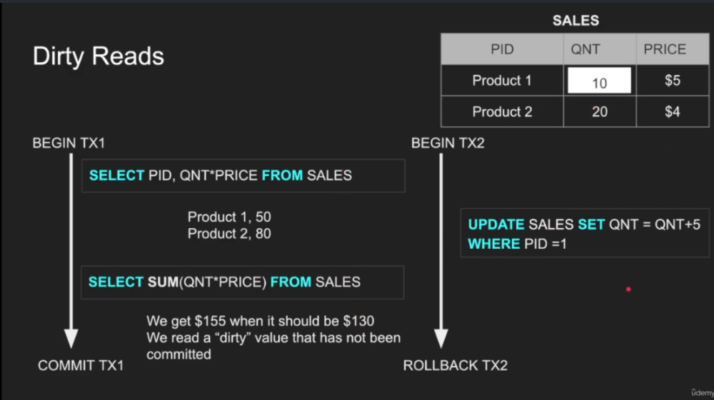
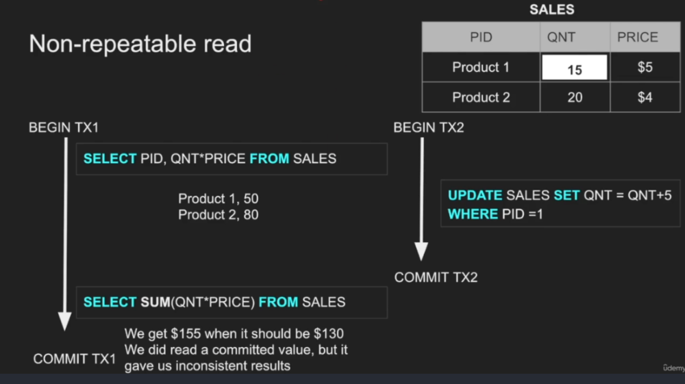
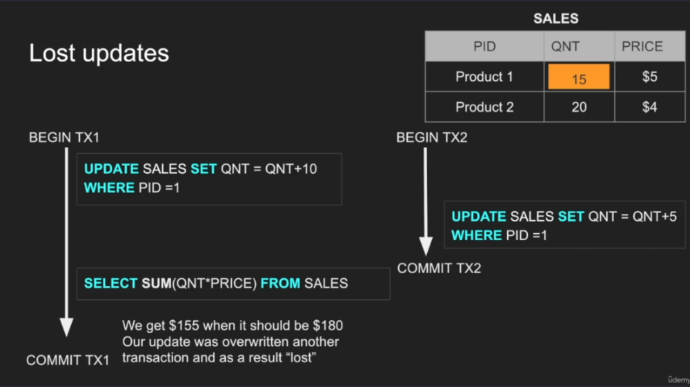
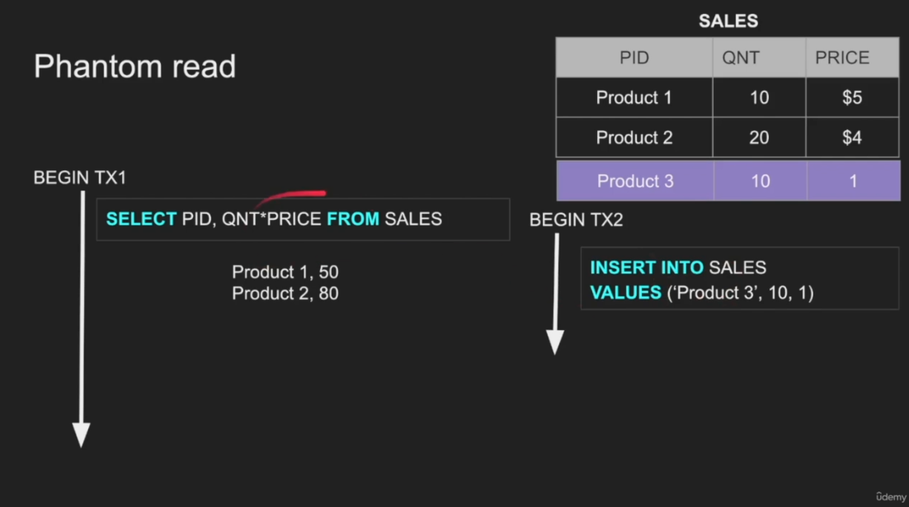
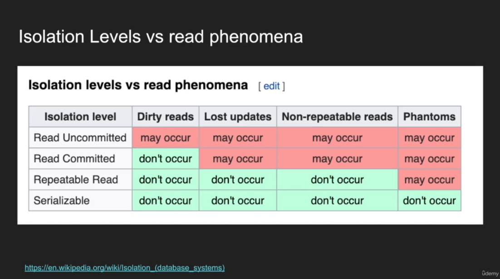
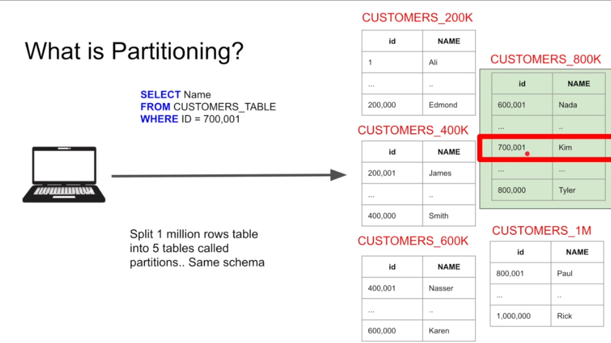
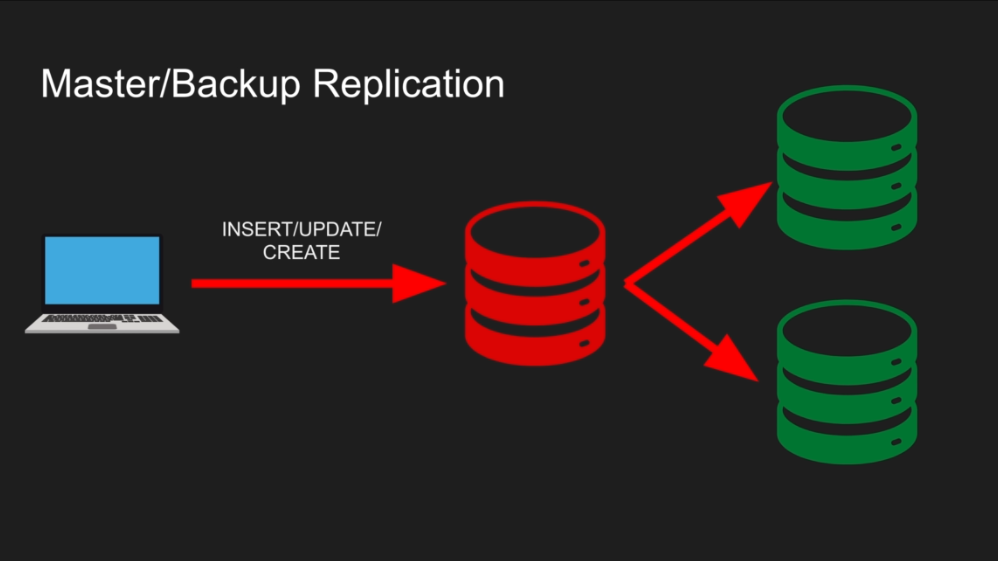
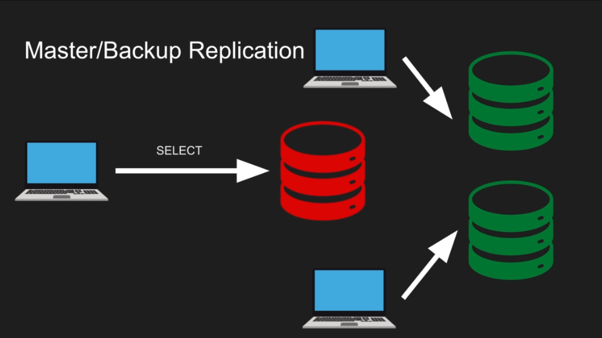

# Database Engineering

this will be a very very long markdown

# ACID

so ACID is about making a database transactions reliable, ACID in general is a CS concept that databases implement

## Atomicity

for a transaction to succeed, It got to work in an atomic manner

so a transaction Is one _ATOM_ where If a part of it fails, the whole transaction has actually failed and should rollback

there is really not to much to talk about in atomicity

## Isolation

Isolation is about Isolating transactions from each others

before Isolation, thier is a problem that Isolatio n solves which is _Read Phenomina_

### Read Phenomena

#### Dirty Read

A dirty read occurs when one transaction reads updates made by another transaction before it has committed. If the second transaction rolls back or crashes, the first transaction will have read incorrect data.



#### Non-Repeatable Read

A non-repeatable read occurs when a transaction reads the same row twice and gets different values because another transaction has committed an update in between the reads.



#### Lost Update

A lost update happens when two transactions read the same data, modify it, and then write it back, overwriting each other's changes.



#### Phantom Read

A phantom read occurs when a transaction re-executes a query and finds additional rows that were inserted by another committed transaction.



---

### Implementing Read Phenomena

#### Dirty Read

##### **Session 1**

```sql
SET SESSION TRANSACTION ISOLATION LEVEL READ UNCOMMITTED;
START TRANSACTION;
UPDATE accounts SET balance = 5000 WHERE id = 1;
```

##### **Session 2**

```sql
SET SESSION TRANSACTION ISOLATION LEVEL READ UNCOMMITTED;
SELECT balance FROM accounts WHERE id = 1;
```

#### Non-Repeatable Read

##### **Session 1**

```sql
SET SESSION TRANSACTION ISOLATION LEVEL READ COMMITTED;
START TRANSACTION;
SELECT balance FROM accounts WHERE id = 1;
```

##### **Session 2**

```sql
SET SESSION TRANSACTION ISOLATION LEVEL READ COMMITTED;
START TRANSACTION;
UPDATE accounts SET balance = 5000 WHERE id = 1;
COMMIT;
```

##### **Back to Session 1**

```sql
SELECT balance FROM accounts WHERE id = 1;
```

#### Lost Updates

##### **Session 1**

```sql
START TRANSACTION;
SELECT balance FROM accounts WHERE id = 1;
UPDATE accounts SET balance = balance + 500 WHERE id = 1;
```

##### **Session 2**

```sql
START TRANSACTION;
SELECT balance FROM accounts WHERE id = 1;
UPDATE accounts SET balance = balance - 200 WHERE id = 1;
```

##### **Both Transactions Commit**

```sql
COMMIT;
```

#### Preventing Lost Updates

To prevent lost updates, we can use the `FOR UPDATE` statement to lock the selected rows.

```sql
SELECT balance FROM accounts WHERE id = 1 FOR UPDATE;
```

#### Phantom Read

##### **Session 1**

```sql
SET SESSION TRANSACTION ISOLATION LEVEL REPEATABLE READ;
START TRANSACTION;
SELECT COUNT(*) FROM accounts WHERE balance > 1000;
```

##### **Session 2**

```sql
SET SESSION TRANSACTION ISOLATION LEVEL REPEATABLE READ;
START TRANSACTION;
INSERT INTO accounts (id, balance) VALUES (10, 2000);
COMMIT;
```

##### **Back to Session 1**

```sql
SELECT COUNT(*) FROM accounts WHERE balance > 1000;
```

### Types of Isolation levels

- **READ UNCOMMITED** where there is no Isolation at all

- **READ COMMITED** each query can only see commited changes

- **REPEATABLE READ** when a query reads a row, that row will not be changed untill the transaction ends

- **SNAPSHOT** each transaction has a version of the data to work on

- **SERIALIZED** transactions will be excecuted in chain



### How Isolation is imlemented

- **Pessemistic** it locks the entity

- **Optimestic** it don't lock but track for changes

## Concistency

it is when data achieves refrential integrity and consistency in genereal

consistency in read and write

## durability

when commiting changes, theses changes got to be stored on disk, which might take a long time or may crash, so databases invents algorithms to achieve durable data operations

---

END OF ACID

# Database Internals

this chapter talks about 4 things

- each row has a unique ID, it maybe set by the DBMS or primary key like in MySQL

- each set of rows is stored in form of pages

- there are two types of databases
  - the ones thatr stores tables in form of rows
  - the othe stores data in form of colomns

## Colomns vs rows

this debate is very deep into the design of the tables but generally:

### **Row-Based DBMS (Relational Databases)**

- **Examples**: MySQL, PostgreSQL, SQL Server, Oracle
- **Best for**: Transactional (OLTP - Online Transaction Processing) workloads

#### **When to Use Row-Based DBMS:**

1. **Frequent Read and Write Transactions** – Useful for applications that require frequent inserts, updates, and deletes (e.g., banking, e-commerce, inventory management).
2. **Data Retrieval by Full Rows** – If queries often need to fetch complete records (e.g., retrieving all details about a customer or an order).
3. **ACID Compliance** – When strong consistency, atomicity, and reliability are required.
4. **Index-Based Querying** – Efficient when using indexes for looking up single or small sets of records.

---

### **Column-Based DBMS (Columnar Databases)**

- **Examples**: Apache Cassandra, Google BigQuery, ClickHouse, Amazon Redshift
- **Best for**: Analytical (OLAP - Online Analytical Processing) workloads

#### **When to Use Column-Based DBMS:**

1. **Analytical Queries on Large Datasets** – Ideal for data warehousing, reporting, and business intelligence (BI) applications.
2. **Aggregations on Specific Columns** – Optimized for queries that involve SUM, AVG, COUNT, GROUP BY, etc., across millions or billions of rows.
3. **Data Compression & Faster Reads** – Columnar storage allows better compression and efficient scans of selected columns instead of entire rows.
4. **Appending Data** – Works well for workloads where data is primarily appended and rarely updated (e.g., event logs, IoT data, historical analysis).

---

### **Key Trade-offs**

| Feature                   | Row-Based DBMS               | Column-Based DBMS              |
| ------------------------- | ---------------------------- | ------------------------------ |
| **Best for**              | OLTP (transactions)          | OLAP (analytics)               |
| **Querying**              | Fetching full records        | Aggregations on large datasets |
| **Write Performance**     | Fast inserts/updates/deletes | Optimized for batch inserts    |
| **Read Performance**      | Good for row-based lookups   | Fast for column-based queries  |
| **Storage & Compression** | Less efficient for analytics | High compression for columns   |
| **Indexing**              | Needed for performance       | Often not needed               |

### **Choosing the Right One**

- **For a transactional web app (e.g., e-commerce, CRM, banking system)** → Use **row-based DBMS**.
- **For analytics and reporting (e.g., big data, dashboards, machine learning logs)** → Use **column-based DBMS**.
- **For hybrid workloads** → Some databases (e.g., PostgreSQL with columnar extensions, MariaDB ColumnStore) support both.

# Indexing

Indexing is building a data structure with the rows to access the data faster.

## Types of Indexes

### 1. Primary Index

- Automatically created on the **primary key** of a table.
- Ensures rows are **sorted** in order.
- Only **one** primary index per table.

#### Example:

```sql
CREATE TABLE users (
    id SERIAL PRIMARY KEY,
    name VARCHAR(100),
    email VARCHAR(100) UNIQUE
);
```

### 2. Unique Index

- Ensures the column values are **unique**.
- Prevents duplicate data entries.

#### Example:

```sql
CREATE UNIQUE INDEX unique_email ON users(email);
```

### 3. Clustered Index

- Defines the **physical order** of rows in a table.
- Only **one** clustered index per table.

#### Example:

```sql
CREATE CLUSTERED INDEX idx_user_id ON users(id);
```

### 4. Non-Clustered Index

- Stores a separate structure that points to the actual data rows.
- Multiple non-clustered indexes can exist per table.

#### Example:

```sql
CREATE INDEX idx_user_name ON users(name);
```

### 5. Composite Index (Multi-Column Index)

- Indexes multiple columns for optimizing multi-column searches.

#### Example:

```sql
CREATE INDEX idx_user_name_email ON users(name, email);
```

### 6. Full-Text Index

- Used for **text search** on large textual data.

#### Example (MySQL):

```sql
CREATE FULLTEXT INDEX idx_user_bio ON users(bio);
```

### 7. Bitmap Index

- Efficient for **low-cardinality columns** (few unique values like `status`).
- Used in **data warehouses**.

### 8. Hash Index

- Optimized for **exact match lookups**.
- Not suitable for **range queries**.

#### Example (PostgreSQL):

```sql
CREATE INDEX idx_user_email_hash ON users USING HASH(email);
```

### 9. Partial Index

- Indexes **only a subset** of rows to save space and improve performance.

#### Example:

```sql
CREATE INDEX idx_active_users ON users(email) WHERE status = 'Active';
```

### 10. Covering Index

- Includes all columns needed for a query to avoid reading the table.

#### Example:

```sql
CREATE INDEX idx_user_email_name ON users(email, name);
```

## Indexing Algorithms

Indexing has several algorithms based on the type of the data and operations expected on these data.

### 1. B-Tree Index

- A self-balancing tree structure where nodes maintain sorted data.
- Efficient for **range queries** and **sorted data retrieval**.
- Used in most relational databases.

### 2. B+ Tree Index

- A variation of B-Trees where **only leaf nodes store actual data**.
- Internal nodes contain only keys for faster traversal.
- Supports **sequential scans** efficiently.

### 3. Hash Index

- Uses **hashing functions** to map keys to memory locations.
- Best for **exact match lookups**, but **not efficient** for range queries.

### 4. Bitmap Index

- Uses **bitmaps** (arrays of 0s and 1s) to represent data efficiently.
- Best suited for **low-cardinality columns** (few unique values, e.g., gender, status).
- Commonly used in **data warehouses**.

### 5. Trie (Prefix Tree)

- A tree data structure where each node represents a character in a key.
- Best for **prefix searches** (e.g., autocomplete, dictionary lookups).
- Used in **full-text search engines**.

### 6. Skip List Index

- A linked list-based index with multiple levels for fast traversal.
- Provides **O(log N) search time**, similar to B-Trees.
- Used in databases requiring **fast inserts and reads**.

### 7. R-Tree Index (Spatial Indexing)

- Used for **geospatial indexing** (e.g., maps, geographic locations).
- Efficient for **bounding box searches** and **2D/3D spatial data**.
- Commonly found in **PostGIS, Oracle Spatial**.

### Choosing the Right Indexing Algorithm

| Algorithm            | Best for                                | Drawbacks                               |
| -------------------- | --------------------------------------- | --------------------------------------- |
| **B-Tree / B+ Tree** | General-purpose indexing, range queries | Slower for large writes                 |
| **Hash Index**       | Exact match queries (`WHERE email = ?`) | No range queries (`<, >, BETWEEN`)      |
| **Bitmap Index**     | Low-cardinality columns (e.g., status)  | Large storage for high-cardinality data |
| **Trie**             | Prefix searches (e.g., autocomplete)    | High memory usage                       |
| **Skip List**        | Fast inserts and reads                  | More memory overhead                    |
| **R-Tree**           | Geospatial queries                      | Complex to maintain                     |

# Partitioning

partitioning is spliting a table into multiple tables, thats it



## Horizontal vs vertical partition

I think this this table is the best ever demonstration of the topic, thank you chat-gpt

| Feature                | **Horizontal Partitioning**                                                                                       | **Vertical Partitioning**                                                                                            |
| ---------------------- | ----------------------------------------------------------------------------------------------------------------- | -------------------------------------------------------------------------------------------------------------------- |
| **Concept**            | Divides a table into multiple rows based on a condition (e.g., range, hash, or list).                             | Splits a table into multiple columns across different tables.                                                        |
| **Structure**          | Each partition has the same schema but different subsets of data.                                                 | Each partition has different columns but shares a common primary key.                                                |
| **Use Case**           | Useful when dealing with a large number of rows that need to be distributed across multiple servers or databases. | Useful when a table has too many columns, and some are rarely used together.                                         |
| **Performance Impact** | Improves query performance by reducing the number of rows scanned.                                                | Improves query performance by reducing the number of columns read.                                                   |
| **Scalability**        | Good for scaling out (sharding across multiple servers).                                                          | Helps optimize storage and memory usage.                                                                             |
| **Example**            | A customer table is split by country, with each partition containing customers from a specific country.           | A user profile table is split into `user_basic_info` (ID, Name, Email) and `user_preferences` (ID, Theme, Language). |
| **Complexity**         | Requires partitioning logic and proper indexing to optimize queries.                                              | Requires joining tables in queries, which can increase complexity.                                                   |

### **When to Use Each?**

- **Use Horizontal Partitioning** if you have a massive dataset and need to distribute the load across multiple servers (e.g., sharding in NoSQL databases).
- **Use Vertical Partitioning** if a table has too many columns and queries only need a subset of them, reducing read latency and memory consumption.

## Types of partitioning

either by range or by list or by hash

here is yet another aawesome chat-gpt table comparing between types of partitioning types

| Feature               | **Range Partitioning**                                      | **List Partitioning**                                                        | **Hash Partitioning**                                    |
| --------------------- | ----------------------------------------------------------- | ---------------------------------------------------------------------------- | -------------------------------------------------------- |
| **Concept**           | Divides data based on a range of values.                    | Divides data based on predefined discrete values.                            | Distributes data evenly using a hash function.           |
| **Use Case**          | When data has a natural order (e.g., dates, numerical IDs). | When data fits into specific, known categories (e.g., regions, departments). | When uniform distribution is needed to avoid hotspots.   |
| **Partitioning Key**  | A column with sequential values (e.g., `date`, `ID`).       | A column with a fixed set of values (e.g., `region`, `category`).            | A column that can be hashed (e.g., `user_id`).           |
| **Query Performance** | Efficient for range-based queries.                          | Efficient for queries targeting specific categories.                         | Helps distribute load but requires hash computation.     |
| **Scalability**       | Easy to add new partitions as new ranges emerge.            | Requires updating partitions if new categories are added.                    | Good for large-scale distributed databases.              |
| **Example Use Case**  | Sales data partitioned by month.                            | Customer data partitioned by country.                                        | User data evenly distributed across multiple partitions. |

---

### **SQL Examples**

#### **1. Range Partitioning**

Used when data can be divided into sequential ranges (e.g., dates, IDs).

```sql
CREATE TABLE orders (
    order_id INT PRIMARY KEY,
    order_date DATE NOT NULL
) PARTITION BY RANGE (order_date);

CREATE TABLE orders_2023 PARTITION OF orders
    FOR VALUES FROM ('2023-01-01') TO ('2023-12-31');

CREATE TABLE orders_2024 PARTITION OF orders
    FOR VALUES FROM ('2024-01-01') TO ('2024-12-31');
```

- New orders are automatically placed in the correct partition.
- Optimized for date-based queries (e.g., **`WHERE order_date BETWEEN '2023-01-01' AND '2023-12-31'`**).

---

#### **2. List Partitioning**

Used when data falls into distinct categories.

```sql
CREATE TABLE customers (
    customer_id INT PRIMARY KEY,
    country TEXT NOT NULL
) PARTITION BY LIST (country);

CREATE TABLE customers_egypt PARTITION OF customers
    FOR VALUES IN ('Egypt');

CREATE TABLE customers_usa PARTITION OF customers
    FOR VALUES IN ('USA');

CREATE TABLE customers_other PARTITION OF customers
    DEFAULT;
```

- Queries like **`WHERE country = 'Egypt'`** are optimized.
- If a country doesn’t match any partition, it goes to the **default** partition.

---

#### **3. Hash Partitioning**

Used to distribute data evenly across multiple partitions.

```sql
CREATE TABLE users (
    user_id INT PRIMARY KEY,
    username TEXT NOT NULL
) PARTITION BY HASH (user_id);

CREATE TABLE users_p0 PARTITION OF users
    FOR VALUES WITH (MODULUS 4, REMAINDER 0);

CREATE TABLE users_p1 PARTITION OF users
    FOR VALUES WITH (MODULUS 4, REMAINDER 1);

CREATE TABLE users_p2 PARTITION OF users
    FOR VALUES WITH (MODULUS 4, REMAINDER 2);

CREATE TABLE users_p3 PARTITION OF users
    FOR VALUES WITH (MODULUS 4, REMAINDER 3);
```

- A **hash function** ensures even data distribution.
- Works well for **high-traffic applications** like user authentication systems.

---

### **When to Use Each?**

- **Use Range Partitioning** if your queries filter by ordered values (e.g., dates).
- **Use List Partitioning** if your data naturally falls into predefined groups.
- **Use Hash Partitioning** if you need even load distribution across multiple partitions.

## Attaching partitions

### **What Does "Attach Partition" Mean?**

- Imagine you already have **separate tables** storing data.
- Later, you decide that instead of keeping them separate, you want to **group them together as partitions** in a new table.
- Instead of moving data manually, you can **attach** these tables as partitions.

---

### **Example: Attaching Existing Tables as Partitions**

#### **Scenario**

You have two tables, `orders_2023` and `orders_2024`, storing order data for different years. Initially, they were just **normal tables**.

Now, you decide to **create a main `orders` table** that will organize these by **year-based partitions**.

#### **Step 1: Create the Partitioned Table**

```sql
CREATE TABLE orders (
    order_id INT PRIMARY KEY,
    order_date DATE NOT NULL
) PARTITION BY RANGE (order_date);
```

✅ This is an **empty partitioned table**, ready to accept partitions.

#### **Step 2: Create Separate Tables (if not already existing)**

```sql
CREATE TABLE orders_2023 (
    order_id INT PRIMARY KEY,
    order_date DATE NOT NULL
);

CREATE TABLE orders_2024 (
    order_id INT PRIMARY KEY,
    order_date DATE NOT NULL;
);
```

✅ These tables already **exist** and contain data.

#### **Step 3: Attach Existing Tables as Partitions**

```sql
ALTER TABLE orders ATTACH PARTITION orders_2023
FOR VALUES FROM ('2023-01-01') TO ('2023-12-31');

ALTER TABLE orders ATTACH PARTITION orders_2024
FOR VALUES FROM ('2024-01-01') TO ('2024-12-31');
```

✅ Now, `orders_2023` and `orders_2024` **become partitions of `orders`**, without copying or modifying their data.

---

### **🔹 Why is This Useful?**

1. **No Data Movement** → The data stays in place; we just tell the database to treat these tables as partitions.
2. **Fast Query Performance** → Queries on `orders` now automatically route to the correct partition.
3. **Easy Migration** → If you had old, separate tables, you can integrate them into a partitioned system without rebuilding everything.

---

### **What Happens After Attaching a Partition?**

- If you run:

```sql
SELECT * FROM orders WHERE order_date = '2023-05-01';
```

✅ It will automatically **fetch data only from `orders_2023`**, improving performance.

- If you insert:

```sql
INSERT INTO orders (order_id, order_date) VALUES (101, '2024-03-15');
```

✅ The row **goes directly into `orders_2024`** without needing manual placement.

---

## Indexing with Partitioning

### Key Differences in Indexing Partitioned Tables

1. **Indexes are not inherited**
   - If you create an index on the **parent partitioned table**, it won’t automatically apply to child partitions.
   - You need to **create indexes on each partition separately**.
2. **Global vs. Local Indexes**
   - **Global Indexes**: One index covering all partitions (not supported in PostgreSQL).
   - **Local Indexes**: Separate indexes on each partition (used in PostgreSQL).

---

### Example: Creating Indexes in a Partitioned Table

#### Step 1: Create a Partitioned Table

```sql
CREATE TABLE orders (
    order_id INT PRIMARY KEY,
    order_date DATE NOT NULL,
    customer_id INT NOT NULL
) PARTITION BY RANGE (order_date);
```

This is the **main partitioned table**.

---

#### Step 2: Create Partitions

```sql
CREATE TABLE orders_2023 PARTITION OF orders
    FOR VALUES FROM ('2023-01-01') TO ('2023-12-31');

CREATE TABLE orders_2024 PARTITION OF orders
    FOR VALUES FROM ('2024-01-01') TO ('2024-12-31');
```

Now we have **two partitions**.

---

#### Step 3: Create Indexes on Each Partition

```sql
CREATE INDEX orders_2023_idx ON orders_2023 (customer_id);
CREATE INDEX orders_2024_idx ON orders_2024 (customer_id);
```

Each partition now has **its own index**.

---

### Query Execution with Indexed Partitioning

If you run:

```sql
SELECT * FROM orders WHERE order_date = '2023-06-01' AND customer_id = 5;
```

#### How It Works:

1. **Partition Pruning**: The query planner **only scans `orders_2023`**.
2. **Index Usage**: The index on `orders_2023 (customer_id)` speeds up the query.

---

### Alternative: Creating an Index on the Parent Table

You can **define an index on the parent** that automatically applies to new partitions:

```sql
CREATE INDEX ON ONLY orders (customer_id);
```

#### Important Notes:

- This does **not** index existing partitions.
- It acts as a **template** for new partitions.
- If you **want indexes on all existing partitions**, you must create them **manually**.

---

### Summary

- **Partitioned tables don’t share indexes with child partitions.**
- **Indexes must be created separately on each partition.**
- **Global indexes (across all partitions) are not supported in PostgreSQL.**
- **Use "ON ONLY" to create an index template for new partitions.**

# Sharding

sharding is distriputing data over multiple databases over multiple locations

let us say that odd IDs are stored on a server and even IDs are stored on another server

then an application level sharding would be like this

```js
const mysql = require("mysql2");

// Define connections for shards
const shard1 = mysql.createConnection({
  host: "shard1_host",
  user: "root",
  database: "db1",
});
const shard2 = mysql.createConnection({
  host: "shard2_host",
  user: "root",
  database: "db2",
});

function getShard(userId) {
  return userId % 2 === 0 ? shard1 : shard2; // just picks the desired server's pointer
}

function insertUser(userId, name) {
  const shard = getShard(userId);
  shard.query(
    "INSERT INTO users (id, name) VALUES (?, ?)",
    [userId, name],
    (err) => {
      if (err) console.error(err);
    }
  );
}
```

# Concurrency control

Pessimistic and optimistic concurrency control are two different approaches to managing concurrent access to a database in **Database Management Systems (DBMSs)**.

## **1. Pessimistic Concurrency Control**

- **Concept**: Assumes conflicts **will happen**, so it prevents them by **locking** resources before making changes.
- **Mechanism**: Uses **locks (exclusive locks, shared locks)** to ensure that only one transaction can modify a resource at a time.
- **Common Usage**: When there is a high likelihood of conflicts, such as in high-write environments like financial systems.

### **How to Achieve Pessimistic Concurrency Control**

- **Row-Level Locking**: `SELECT ... FOR UPDATE` (Locks the row until the transaction is committed or rolled back).
  ```sql
  BEGIN;
  SELECT * FROM accounts WHERE id = 1 FOR UPDATE;
  UPDATE accounts SET balance = balance - 100 WHERE id = 1;
  COMMIT;
  ```
- **Table-Level Locking**: `LOCK TABLE table_name IN EXCLUSIVE MODE;`
- **Explicit Locking in Application Code**: Using `SELECT ... LOCK IN SHARE MODE` for read consistency.

---

## **2. Optimistic Concurrency Control**

- **Concept**: Assumes conflicts **are rare**, so it allows multiple transactions to proceed without locking but **checks for conflicts before committing**.
- **Mechanism**: Uses **versioning (timestamps, row versions) or "Compare and Swap" techniques**.
- **Common Usage**: When there are more reads than writes, such as in web applications and analytics systems.

### **How to Achieve Optimistic Concurrency Control**

- **Using Version Numbers**

  ```sql
  -- Read data along with its version
  SELECT id, balance, version FROM accounts WHERE id = 1;

  -- Attempt update only if version has not changed
  UPDATE accounts
  SET balance = balance - 100, version = version + 1
  WHERE id = 1 AND version = 5;
  ```

  If the update affects **zero rows**, another transaction modified the row, and you must retry.

- **Using Timestamps**

  ```sql
  -- Read row with timestamp
  SELECT id, balance, last_updated FROM accounts WHERE id = 1;

  -- Update only if timestamp is unchanged
  UPDATE accounts
  SET balance = balance - 100, last_updated = CURRENT_TIMESTAMP
  WHERE id = 1 AND last_updated = '2025-03-26 12:34:56';
  ```

  If no rows were updated, retry the transaction.

---

## **Comparison Table**

| Feature                | Pessimistic Concurrency Control                  | Optimistic Concurrency Control          |
| ---------------------- | ------------------------------------------------ | --------------------------------------- |
| **Assumption**         | Conflicts **will** happen                        | Conflicts **are rare**                  |
| **How it works**       | Locks resources before updates                   | Detects conflicts at commit             |
| **Performance Impact** | Slower due to locking                            | Faster due to no locking                |
| **Best for**           | High-write systems (banking, transactions)       | High-read systems (web apps, analytics) |
| **Drawbacks**          | Can cause **deadlocks**, slows down transactions | Requires retry logic, can fail updates  |

If your system is **write-heavy and needs strict consistency**, go with **pessimistic control**. If your system is **read-heavy with fewer conflicts**, go with **optimistic control**.

# Replication

unlike sharding; replication is making multiple copies of the same database

## types of replication:

### Master/backup replication

one master node that writes data; another many nodes that reads theses data





this is best for many reads and few writes

### Multi-master replication

many node can write

this is complex as it needs conflict management

## Synchronous vs Asynchronous writes

- **Synchronous** Each write to the master will wait for existing writes to finish and is not considered successful until the master finishes writing to the replicas

- **ASynchronous** write is considered successfull once the change is submitted to the master and in the other hand changes are then applied asynchronously

## Replication with MySQL

Replication is quite hard to implement and it's syntax differes from DBMS to the other
